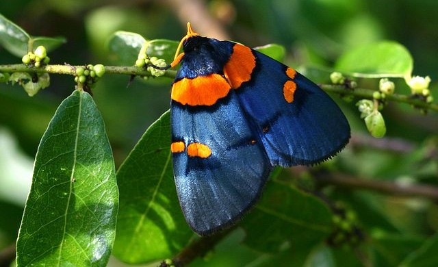
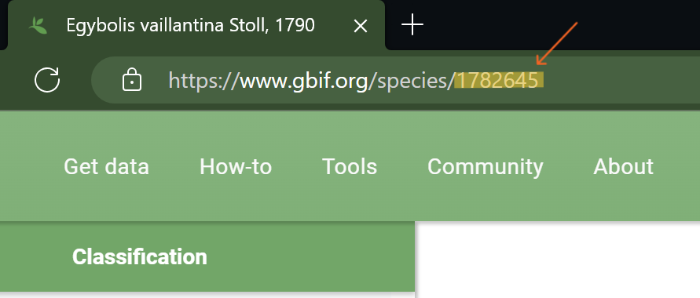

Here we will demonstrate how to query, download, and prepare species occurrence data.

------------------------------------------------------------------------

### Learning Objectives

1.  Be able to request and download data from GBIF.

2.  Be able to perform basic data cleaning.

3.  Understand the value of checking intermediate products.

4.  Gain a base understanding of species distribution modeling.

------------------------------------------------------------------------

## What is Species Distribution Modeling... and Why is it So Important?

Species distribution models (SDMs) are primarily used to gain insights in ecology and predict distributions across a landscape under given environmental conditions. The predictions might be helpful in assessing locations where an organism might be observed (and has not been yet) and conservation efforts. Using climate models for subsequent years may also give an idea on how the distributions might shift as climate change ensues.

How realistic a model is would be dependent not only on the method but also the quality of the data. In this part, we will be downloading species occurrence data from the Global Biodiversity Information Facility (GBIF) and preparing it for analysis and visualizations.

We will explore the subject of modeling more in a later section of this tutorial.

------------------------------------------------------------------------

## Set-Up

This tutorial will assume the [desktop version of RStudio](https://posit.co/download/rstudio-desktop/) is being employed, but using RStudio through [posit](https://posit.co/?_gl=1%2Axz7m9m%2A_ga%2AMjExODAwODQ2NC4xNzA0NDA0ODky%2A_ga_2C0WZ1JHG0%2AMTcwODEwODk0Mi4xOC4xLjE3MDgxMDg5NTYuMC4wLjA.) should yield a similar experience. First we will need to do the following:

1.  Open RStudio and create a new project (File \> **New Project...**).

2.  Select **New Directory**.

3.  For the Project Type select **New Project**.

4.  For directory name, call it something like "Intro_SDM_Tutorial" (without the quotes).

5.  For the subdirectory, select somewhere you will remember (like "My Documents" or "Desktop").

Once those are complete, we should make some folders to help us stay organized during this tutorial! We will create two folders: (1) a "data" folder for... all the data we will be using, and (2) an "output" folder for results and other products.

To do this, run the following in the RStudio Console:

```{r, eval=FALSE}
# For data
dir.create(path = "data")

# For results
dir.create(path = "output")
```

### Necessary packages

A package in R is a set of functions, often with a certain "theme". For example, some packages might have tools to help run statistical analyses, and others might have tools for dealing with spatial data (those with a referenced geographical location). This section of the tutorial requires the following R packages to assist in our querying and cleaning:

-   **`dplyr`:** Helps manipulate and clean our data.

-   **`ggplot2`:** Creates graphics, such as maps.

-   **`rgbif`:** Allows searching and retrieving data from GBIF. This package wraps code around the GBIF API so data acquisition is possible through communication between GBIF and R.

-   **`usethis`:** Helps in setting up the connection needed to acquire GBIF data via `rgbif`.

We can install and use them by running the following lines:

```{r, eval=FALSE}
# Install packages (Note: This only needs to be done once!)
install.packages("dplyr")
install.packages("ggplot2")
install.packages("rgbif")
install.packages("usethis")
```

Great! Now we have the tools to move forward in this section... almost.

### GBIF Credentials

Before we get into the data fun, there is one more hoop we need to jump through. In order to use the `rgbif` package to pull occurrence data from GBIF, we need to do the following:

1.  Create a GBIF account (if you don't have one already). *Make sure to remember the username, email, and password that you used to create your account*. You can find the website here: <https://www.gbif.org/>

2.  Open up your .Renviron with the code below:

    ```{r, eval=FALSE}
    # This line will open a .REnviron file that will need to be edited
    usethis::edit_r_environ()
    ```

    In this file, you will want to copy and fill in information for following code. *However, do note that you will need to replace anything inside the quotation marks (`""`) with your own user name, password, and email (see #1)*:

    ```{r, eval=FALSE}
    GBIF_USER = "Your user name (first part of your GBIF_EMAIL before the @)"

    GBIF_PWD = "Your GBIF account password"

    GBIF_EMAIL = "The email you're using for your GBIF account"
    ```

3.  Once the information in #2 has been filled into the .Renviron, save that file and restart R. You can find this under **Session** \> **Restart R** at the top of your window. The restart is necessary to "set" the information to access GBIF through R.

------------------------------------------------------------------------

## Getting The Data

### Our Model Species (*insert sparkles*)

{width="552"}

Because I love my moths, we will demonstrate the data acquisition using the African Peach Moth (*Egybolis vaillantina*) as our species of interest. As indicated by the name, its larvae do in fact feed on peaches as well as plants in the genus *Sapindus* (more commonly known as soapberries or soapnuts, and yes, they are used to make soap).

A quick browse through the internet will suggest that this is not a well-documented organism. This might make it a good candidate for some predictive modeling in the event we were interested in determining where else they might be found.

### Raw Data Download

Before going any further, we will first need to bring in the packages we installed earlier. This is done using `library()`, which is a base function of R:

```{r, results='hide', message=FALSE, warning=FALSE}
# Load dependencies
library("dplyr")
library("ggplot2")
library("rgbif")
library("usethis")
```

Unlike the installation (which only needs to be done once -- once a package is installed on your device, it is there for the foreseeable future), the process of bringing in these packages needs to be done every time we open or restart R.

Downloading our moth data from GBIF requires knowing that species' unique identification number is, otherwise known as the taxonKey. In our case, one way this number can be found is by going to GBIF **\>** searching for "*Egybolis vaillantina*" **\>** selecting the appropriate species (Stoll, 1790) **\>** navigating to the search bar and collecting the digits at the end of the hyperlink as shown below:

{width="617"}

This number will be used to pull data from GBIF to R through the function `occ_download()`. The `pred()` function states that we are looking for data where "taxonKey" is equal to 1782645.

```{r, results='hide', message=FALSE, warning=FALSE}
# Request data download from GBIF
occ_download(pred("taxonKey", 1782645))
```

Running the line above will print out the following information, which should be kept for two reasons: (1) citing your data download and (2) retrieving your data download. If all works properly, this information should print out in your R Console:

```{r, eval=FALSE}
Your download is being processed by GBIF:
  https://www.gbif.org/occurrence/download/0024905-240216155721649

Most downloads finish within 15 min.
  
Check status with:
  
    occ_download_wait('0024905-240216155721649')
  
After it finishes, use:
    
  d <- occ_download_get('0024905-240216155721649') %>%
       occ_download_import()
  
to retrieve your download.
  
Download Info:
  Username: "your user"
  E-mail: "your email"
  Format: DWCA
  Download key: 0024905-240216155721649
  Created: 2024-02-28T21:34:30.857+00:00
  
Citation Info:  
  Please always cite the download DOI when using this data.
  https://www.gbif.org/citation-guidelines
  DOI: 10.15468/dl.q9dery
  
Citation:
  GBIF Occurrence Download 
  https://doi.org/10.15468/dl.q9dery 
  Accessed from R via rgbif (https://github.com/ropensci/rgbif) on 2024-02-28
```

Looking through the print-out, we can see that it directs us towards the next step in this process... importing our data! You might be wondering where our current download went, and to answer that it would be located in the Downloads section of your GBIF account. To get that download into R -- specifically into our data folder -- we will make a small modification to the data retrieval code above, which involves filling in the `path` argument:

```{r, results='hide', message=FALSE, warning=FALSE}
# Place data in data folder, and also in an object called "data"
data <- occ_download_get('0024905-240216155721649', path = "data/") %>%
  occ_download_import()

# Data currently has: 389 observations, 223 variables
```

You may notice that we are also storing the data in an object called `data` to the left of `occ_download_get()`, which was done using the `<-` (assignment arrow). This puts our newly downloaded moth data in our R Environment in addition to placing a .zip version of that download in the data folder. To unzip and save it as a .csv, we will run the following line:

```{r, results='hide', message=FALSE, warning=FALSE}
# Save our data as a .csv (raw_data.csv) in the data folder (data/)
write.csv(data, "data/raw_data.csv")
```

Now that we have our raw data, let us clean it up a bit!

------------------------------------------------------------------------

## Cleaning The Data

Making sure our occurrence data is biologically reasonable, has minimal inaccuracies, and representative of our species is important in that using "bad" data will, of course, result in a "bad" output. Modeling in itself already has its own challenges and deriving conclusions requires understanding the conceptual side of the analysis. So, using data that is not as accurate and complete as it could be can result in a model that is a bit more "off" from the reality than would be from thoroughly screened data.

Here we will perform a basic cleaning of our moth data to prepare it for later analysis.

### Load Our Data

Theoretically, let us say you exited the program after saving the raw data and lost the objects in your R Environment. And now you are continuing this tutorial but need the data in there again. Thankfully you do not need to go through all that data acquisition again (assuming you did save the file) and all we need to do is read that .csv back in and call it `data`:

```{r, results='hide', message=FALSE, warning=FALSE}
# Load raw data
data <- read.csv("data/raw_data.csv")

# Data currently has: 389 observations, 223 variables
```

At the moment, we have a data set that looks like this (only showing first six columns since there are 224, and all of them will not fit in one line):

```{r, echo=FALSE}
# View first few rows
head(data[,1:6], 5)
```

Not very useful or visually appealing, is it? We will have this cleaned up by the end of this section.

### Removing NA Coordinates

Having geographic coordinates is important in spatial analyses since it well, provides the locations being used in our analysis. Observations that do not have coordinates associated with them will not be incorporated into the calculations, and may even cause errors if we kept them included in the data set. The `dplyr` package is mainly used the cleaning process here, which includes the pipe (`%>%`) and `filter()` -- a function that removes any data that do not fulfill the stated condition(s). In this case, the data being kept are those without (`!`) NA latitudes or longitudes:

```{r, results='hide', message=FALSE, warning=FALSE}
# Remove NA latitude / longitude values
cleaned_data <- data %>%
  filter(!is.na(decimalLatitude), 
         !is.na(decimalLongitude))

# Data currently has: 374 observations, 223 variables
```

In the interest of distinguishing the starting data and subsequently "cleaned" data, the clean-er data will be called `cleaned_data`.

### Removing Specimens

Observations taken in the wild with georeferenced locations are probably most valuable in the modeling process since the organism was observed in its natural habitat. This helps generate a more realistic prediction of where else the species may occur from our data. GBIF has a [Basis of Record](https://docs.gbif.org/course-data-use/en/basis-of-record.html) category in the metadata that tells us whether the data is a museum or zoo, preserved or live, or human or machine-observed organism. Here, we will omit observations labeled **`LIVING_SPECIMEN`** (those in zoos/gardens) because those are organisms residing in a human-modified habitat that may be in a climate outside of their natural occurrences:

```{r, results='hide', message=FALSE, warning=FALSE}
# Remove organisms that are museum specimens and in zoos
cleaned_data <- cleaned_data %>%
  filter(!basisOfRecord %in% "LIVING_SPECIMEN")

# Data currently has: 374 observations, 223 variables
```

### Removing Duplicates

It would be best to make sure that all our data is as equally represented as possible, since we do not know whether certain areas truly have more occurrences or not. In some cases, records have been published through more than one data set and this can result in a sampling bias. Here we will remove duplicates in a way to ensure that species observed at the same time and location are not counted more than once. Additionally, the `datasetKey` de-duplication ensures that the publication issue is addressed:

```{r, results='hide', message=FALSE, warning=FALSE}
# Remove duplicates by certain criteria
cleaned_data <- cleaned_data %>%
  distinct(decimalLongitude,
           decimalLatitude, 
           speciesKey, 
           day, month, year,
           datasetKey, 
           .keep_all = TRUE)

# Data currently has: 348 observations, 224 variables
```

### Theoretically, What If I Only Wanted Observations in \_\_\_\_\_\_\_\_\_\_?

The moth in this tutorial appears to be restricted to southwestern Africa, but in another scenario where you were interested in a more widespread species it is possible to limit the observations to certain states or countries. This would be done by filtering the `countryCode` and/or the `stateProvince` column.

### Organizing The Data

The table of data we printed earlier showed that there was a number of columns that are probably unnecessary. In the interest of presenting our data better, we will reduce the column number, rename some, and rearrange the observations to show from earliest date to the latest:

```{r, results='hide', message=FALSE, warning=FALSE}
# Reduce columns to what is / might be necessary for analyses / figures
cleaned_data <- cleaned_data %>%
  select(68, 69, 70, 99, 100, 203, 202, 158, 86, 87) %>%
  rename(latitude = decimalLatitude,
         longitude = decimalLongitude) %>%
  arrange(year, month, day)

# Data currently has: 348 observations, 10 variables
```

The columns selected have been numbered just because I prefer the cleanliness of that to typing all the column names out (and the column numbers were identified using `colnames(data)`), but those correspond to:

|                    |                        |
|--------------------|------------------------|
| 68 = year          | 99 = decimalLatitude   |
| 69 = month         | 100 = decimalLongitude |
| 70 = day           | 158 = kingdom          |
| 86 = countryCode   | 202 = speciesKey       |
| 87 = stateProvince | 203 = species          |

And now we can compare our new data set to the one at the beginning of this section (last two columns omitted so the table can fit):

```{r, echo=FALSE, message=FALSE, warning=FALSE}
# View first few rows
head(cleaned_data[,1:8], 5)
```

### Saving The Data

I think we are done preparing our data for mapping and modeling, let us save the cleaned version as:

```{r, results='hide', message=FALSE, warning=FALSE}
# Save our data as a .csv (cleaned_data.csv) in the data folder (data/)
write.csv(data, "data/cleaned_data.csv")
```

Great! Now our data is ready for analysis and visualizations. The next section in this tutorial will show you how to plot these and create an occurrence map.

------------------------------------------------------------------------

## Additional Resources

-   What exactly is GBIF? You can learn about it here: <https://www.gbif.org/what-is-gbif>
-   The importance of cleaning big data: [Quantifying the value of user-level data cleaning for big data: A case study using mammal distribution models](https://www.sciencedirect.com/science/article/abs/pii/S1574954116300577?via%3Dihub)
-   A short paper on SDMs: [Species Distribution Models: Ecological Explanation and Prediction Across Space and Time](https://www.annualreviews.org/doi/10.1146/annurev.ecolsys.110308.120159#:~:text=Species%20distribution%20models%20%28SDMs%29%20are%20numerical%20tools%20that,landscapes%2C%20sometimes%20requiring%20extrapolation%20in%20space%20and%20time.)

------------------------------------------------------------------------

#### Next Section: [link to next lesson]

------------------------------------------------------------------------

For questions, comments, or concerns (or even tattoo design requests) please email tmcruz\@arizona.edu.
